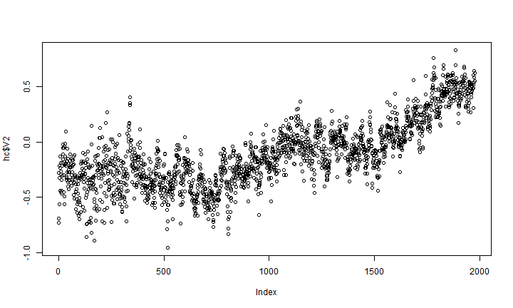
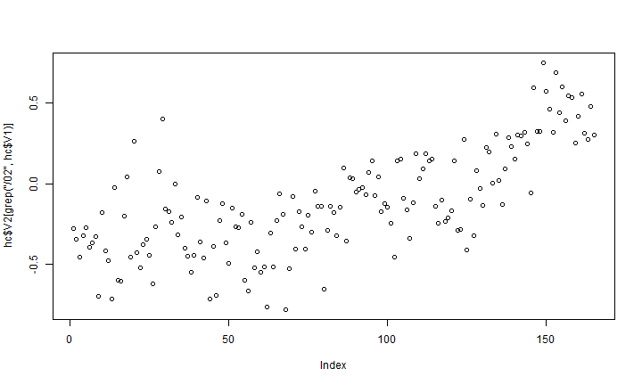
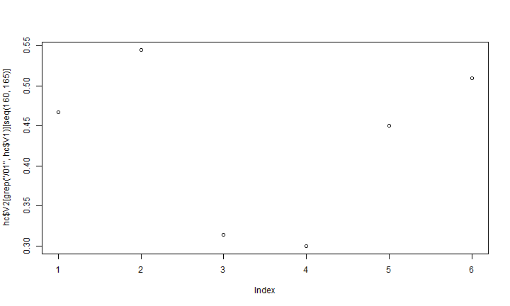
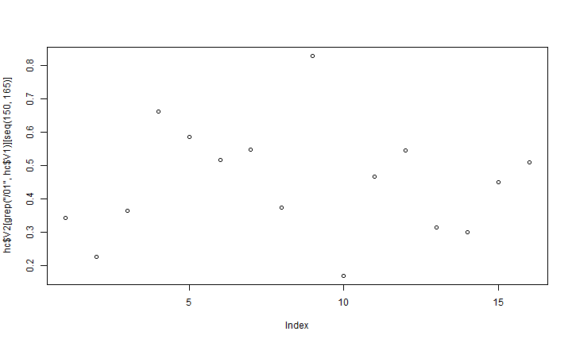

Plotting HadCrut Data
===================================================

I just read about the 'pause' in global warming; according to some time series, world temperatures haven't increased for several years; I decided to take a look for myself.

The dataset they referenced was [HadCRUT4](http://www.metoffice.gov.uk/hadobs/hadcrut4/data/current/download.html), which is available for download, so I decided to download the monthly data and play with it in R.

```r
hc=read.table('http://www.metoffice.gov.uk/hadobs/hadcrut4/data/current/time_series/HadCRUT.4.2.0.0.monthly_ns_avg.txt')
```


The first field is the month, and the second field is the median temperature for that month (other fields have other metrics for the temperature). So, we can plot the whole series

```r
plot(hc$V2)
```

 

Eyeballing, it seems temperatures have been increasing over time (but this is long range, the claim is that they haven't increased lately). The plot is messy, but seems useful.

Temperatures obviously vary from month to month, so we can try comparing temperatures in the same month of different years. The months have format year/month, so we can select those months with /01 etc

January

```r
plot(hc$V2[grep('/01',hc$V1)])
```

 

February

```r
plot(hc$V2[grep('/02',hc$V1)])
```

 

Overall, trend seems to be increasing over the whole range. Now, let's try plotting only the last few values. We have 165 years or so, so we can plot the last few years for Jan


```r
plot(hc$V2[grep('/01',hc$V1)][seq(160,165)])
```

 

Still seems to trend up, but not as clearly ... Let's plot a few more years

```r
plot(hc$V2[grep('/01',hc$V1)][seq(150,165)])
```

 

Now there's no clear trend. Time to learn more about time series analysis (which the paper does), but in the meantime, we can say (with this series):
* It seems temperatures are trending up over a long period
* The trend recently is a lot less clear

But of course, the best thing is that *you* can now play and convince yourself.


